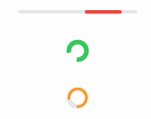
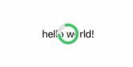

<h1 align="center">Laden</h1>
<p align="center">SwiftUI loading indicator view</p>
<p align="center"></p>

---

### Installation

This component is built using Swift Package Manager, it is pretty straight forward to use:

1. In Xcode (11+), open your project and navigate to `File > Swift Packages > Add Package Dependency...`
2. Paste the repository URL (`https://github.com/vinhnx/Laden`) and click Next.
3. For Rules, select Branch (with branch set to `main`).
4. Click `Finish` to resolve package into your Xcode target.

### Usage

At simplest form:

```swift
import SwiftUI
import Laden

struct ContentView: View {
    var body: some View {
        Laden.CircleLoadingView()
    }
}
```

---

To show loading view on top on current view, you can embed Laden inside a `ZStack`, and put it below your current view:

```swift
ZStack {
    Text("Some text") // your content view
    Laden.CircleOutlineLoadingView()
}
```



> ### [ZStack](https://developer.apple.com/documentation/swiftui/zstack)
> A view that overlays its children, aligning them in both axes.

---

To indicate loading state, have a private loading bool `@State` and bind it to Laden's `isAnimating` initialzier, default value is `true` (or animated by default):

```swift
import SwiftUI
import Laden

struct ContentView: View {
    @State private var isLoading = true

    var body: some View {
        VStack {
            Laden.CircleLoadingView(isAnimating: isLoading)
            Button(isLoading ? "Stop loading" : "Start loading") {
                self.isLoading.toggle()
            }
        }
    }
}
```

---

To show or hide loading view, have a private show/hide bool `@State` and modify said loading with `.hidden` attribute, when toggled:

```swift
import SwiftUI
import Laden

struct ContentView: View {
    @State private var shouldLoadingView = true

    private var loadingView = SwiftUILoading.CircleOutlineLoadingView()

    var body: some View {
        VStack {
            if shouldLoadingView {
                loadingView
                    .hidden()
            } else {
                loadingView
            }

            Button(shouldCircleView ? "Show" : "Hide") {
                self.shouldLoadingView.toggle()
            }
        }
    }
}
```

---

### Customization

To customize loading view color, use `color` initializer:

```swift
Laden.CircleOutlineLoadingView(color: .red)
```

Available customizations:

```swift
/// Loading view protocol that define default configurations.
public protocol LoadingAnimatable: View {
    /// Whether this loading view is animating.
    var isAnimating: Bool { get }

    /// Default color for loading view.
    var color: Color { get }

    /// The default size for loading view.
    var size: CGSize { get set }

    /// Default stroke line width for loading bar.
    var strokeLineWidth: CGFloat { get }
}
```

---

### Acknowledgement 

idea 💡

+ [AppCoda's SwiftUI animation](https://www.appcoda.com/swiftui-animation-basics-building-a-loading-indicator/): for basic building block.
+ [ActivityIndicators](https://github.com/sketch204/ActivityIndicators): for idea how to build and publish a custom SwiftUI control package.

---

### Help, feedback or suggestions?

Feel free to [open an issue](https://github.com/Laden/issues) or contact me on [Twitter](https://twitter.com/@vinhnx) for discussions, news & announcements & other projects. 🚀

I hope you like it! :)
